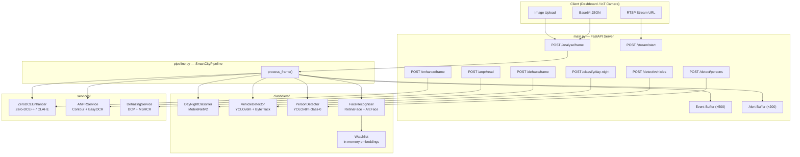

# Smart City Platform — py-server Documentation

> **Last updated:** 2026-06-29 | **Server:** FastAPI + Uvicorn | **Python:** 3.10+

---

## 1. What This Project Does

The `py-server` is the **AI/ML backend** of the Smart City Platform. It accepts images or video streams from cameras deployed across a city and runs multiple computer-vision pipelines on each frame — returning structured JSON results or annotated images.

### Core Use Cases

| Use Case | How It Works |
|----------|-------------|
| **Traffic monitoring** | YOLOv8 detects and tracks cars, trucks, buses, motorcycles with unique IDs |
| **Person crowd monitoring** | YOLOv8 detects and counts people in a scene |
| **Night-time surveillance** | Auto-detects dark frames and enhances them (Zero-DCE++ / CLAHE) before detection |
| **Vehicle number plate reading** | ANPR pipeline localises plates + EasyOCR reads the text |
| **Face watchlist alerts** | Detects faces, generates ArcFace embeddings, matches against a watchlist of persons of interest |
| **Haze/fog removal** | Dark Channel Prior + MSRCR converts foggy frames to clear images |
| **Live RTSP stream processing** | Continuously processes a camera stream as a background task |

---

## 2. Directory Tree

```
py-server/
├── main.py                              ← FastAPI server — all REST endpoints
├── pipeline.py                          ← Orchestrator — ties every service together
├── requirements.txt                     ← pip dependencies
├── yolov8m.pt                           ← YOLOv8m pretrained weights (COCO)
├── structure.md                         ← This documentation file
├── .venv/                               ← Python virtual environment (gitignored)
│
├── clashifiers/                         ← Individual classifier modules
│   ├── day_night/
│   │   ├── __init__.py
│   │   └── main.py                      ← Day/Night Classifier (MobileNetV2)
│   ├── vechile_detector/
│   │   ├── __init__.py
│   │   └── main.py                      ← Vehicle Detector (YOLOv8m + ByteTrack)
│   ├── face_recognization/
│   │   ├── __init__.py
│   │   └── main.py                      ← Face Recogniser (RetinaFace + ArcFace)
│   └── person_detector/
│       ├── __init__.py
│       └── main.py                      ← Person Detector (YOLOv8m COCO class 0)
│
├── services/
│   ├── __init__.py
│   ├── zero_dce.py                      ← Night enhancer (Zero-DCE++ / CLAHE fallback)
│   ├── anpr.py                          ← Number plate recognition (EasyOCR)
│   └── dehazing.py                      ← Haze/fog removal (DCP + MSRCR)
│
└── Zero-DCE_extension/                  ← Cloned Zero-DCE++ repo (pretrained weights)
    └── Zero-DCE++/
        ├── model.py                     ← Network architecture
        ├── Myloss.py                    ← Custom loss functions
        ├── dataloader.py                ← Dataset loader
        ├── lowlight_train.py            ← Training script
        ├── lowlight_test.py             ← Inference script
        └── snapshots_Zero_DCE++/
            └── Epoch99.pth              ← Pretrained weights (99 epochs)
```

---

## 3. All REST API Routes

**Base URL:** `http://localhost:8000`  
**Swagger UI:** `http://localhost:8000/docs`

### Health

| Method | Route | Description |
|--------|-------|-------------|
| `GET` | `/` | Health check — returns `{ service, docs, status }` |
| `GET` | `/status` | Pipeline ready state + uptime + model names |

### Analysis (Full Pipeline)

| Method | Route | Input | Output |
|--------|-------|-------|--------|
| `POST` | `/analyse/frame` | Image upload | JSON — all classifiers (day/night + vehicles + persons + plates + faces + alerts) |
| `POST` | `/analyse/base64` | Base64 JSON body | Same as above |
| `POST` | `/analyse/frame/annotated` | Image upload | Annotated JPEG with all bounding boxes drawn |

### Classifiers (Individual)

| Method | Route | Input | Output |
|--------|-------|-------|--------|
| `POST` | `/classify/day-night` | Image upload | `{ label, confidence, route_to_enhancement, method }` |
| `POST` | `/enhance/frame` | Image upload | Enhanced JPEG (Zero-DCE++ or CLAHE fallback) |
| `POST` | `/detect/vehicles` | Image upload | JSON — vehicle list with bbox, label, confidence, track_id |
| `POST` | `/detect/persons` | Image upload | JSON — person list with bbox, confidence, track_id, center, area |

### ANPR (Number Plate Recognition)

| Method | Route | Input | Output |
|--------|-------|-------|--------|
| `POST` | `/anpr/read` | Image upload | JSON — plates with bbox, raw_text, cleaned_text, confidence |
| `POST` | `/anpr/read/annotated` | Image upload | Annotated JPEG with plate text drawn on image |

### Dehazing

| Method | Route | Input | Output |
|--------|-------|-------|--------|
| `POST` | `/dehaze/frame` | Image upload + `strength` (0.5–1.0) | Dehazed JPEG — auto selects DCP or MSRCR |
| `POST` | `/dehaze/frame/compare` | Image upload | Side-by-side comparison JPEG (original vs dehazed) |

### Stream (RTSP / Live Camera)

| Method | Route | Description |
|--------|-------|-------------|
| `POST` | `/stream/start` | Start processing an RTSP stream as a background task |
| `POST` | `/stream/stop` | Signal the stream to stop |
| `GET` | `/stream/status` | Returns `{ running, source, camera_id, frames_processed, error }` |

### Watchlist (Face Alerts)

| Method | Route | Description |
|--------|-------|-------------|
| `POST` | `/watchlist/add` | Upload reference photo → extract ArcFace embedding → store |
| `DELETE` | `/watchlist/{person_id}` | Remove person from watchlist |
| `GET` | `/watchlist` | List all persons on the watchlist |

### Events & Alerts

| Method | Route | Description |
|--------|-------|-------------|
| `GET` | `/events?limit=50` | Last N frame events from in-memory ring buffer |
| `GET` | `/alerts?limit=100` | All face-watchlist hit alerts |
| `DELETE` | `/events` | Clear both event and alert buffers |

---

## 4. File-by-File Reference

---

### `main.py` — FastAPI Server

**Role:** Entry point for all HTTP requests. Loads the pipeline once at startup, routes requests to the correct service, serialises results.

**Key internals:**
- `lifespan()` — FastAPI lifespan handler that constructs `SmartCityPipeline` at startup and cleans up streams on shutdown
- `event_buffer` — `deque(maxlen=500)` storing the last 500 frame JSON results
- `alert_buffer` — `deque(maxlen=200)` storing face watchlist hit alerts
- `_decode_bytes(raw)` — decodes raw file upload bytes into a BGR numpy array
- `_decode_b64(b64)` — decodes base64 string into a BGR numpy array
- `_serialise(event)` — converts `FrameEvent` to JSON-safe dict, stripping numpy embeddings
- `_store(event)` — appends event + alerts to both ring buffers
- CORS middleware enabled for all origins (development mode)

---

### `pipeline.py` — Pipeline Orchestrator

**Role:** Instantiated once at startup. Owns every model. `process_frame()` is the single call that runs the entire AI pipeline on one BGR frame.

**Pipeline flow per frame:**

```
BGR Frame
    │
    ▼
[1] DayNightClassifier.predict()
    │
    ├── night? ──▶ [2] ZeroDCEEnhancer.enhance()   (Zero-DCE++ or CLAHE)
    │                         │
    └─────────────────────────┘
                  │
    ┌─────────────┼─────────────┬─────────────────┐
    ▼             ▼             ▼                 ▼
[3] VehicleDetector  [4] PersonDetector  [5] ANPRService  [6] FaceRecogniser
    .detect()            .detect()           .read_plates()    .recognise()
    │                    │                   │                 │
    └─────────────────────────────────────────┘─────────────────┘
                              ▼
                [7] Alert collection (face watchlist hits)
                              ▼
                         FrameEvent
                    (returned to API / stored in ring buffer)
```

**`FrameEvent` dataclass fields:**

| Field | Type | Description |
|-------|------|-------------|
| `frame_id` | `str` | Auto-generated (e.g. `frame_000042`) |
| `camera_id` | `str` | Which camera this frame is from |
| `timestamp` | `float` | Unix timestamp |
| `day_night` | `dict` | `{ label, confidence, route_to_enhancement, method }` |
| `enhanced` | `bool` | Whether night enhancement was applied |
| `vehicles` | `VehicleDetectionResult` | All vehicle detections |
| `persons` | `PersonDetectionResult` | All person detections |
| `plates` | `ANPRResult` | All number plate readings |
| `faces` | `list[FaceResult]` | All face detections + watchlist matches |
| `alerts` | `list[dict]` | Face watchlist hit alerts |

**`SmartCityPipeline` constructor args:**

| Arg | Default | Description |
|-----|---------|-------------|
| `camera_id` | `"cam_01"` | Camera identifier |
| `vehicle_model_size` | `"yolov8m"` | YOLOv8 variant (n/s/m/l/x) |
| `face_ctx_id` | `-1` | InsightFace context: -1 = CPU, 0 = GPU |
| `day_night_weights` | `None` | Optional custom day/night weights |
| `face_sim_threshold` | `0.55` | Cosine similarity threshold for watchlist match |

---

### `clashifiers/day_night/main.py` — Day/Night Classifier

**Model:** MobileNetV2 (ImageNet pretrained, frozen backbone)  
**Input:** BGR numpy array (any resolution)  
**Output:** `{ label, confidence, route_to_enhancement, method }`

**Two-stage strategy:**
1. **Brightness heuristic** — computes mean greyscale brightness. If ≥ 160 → day, if ≤ 60 → night. Instant, no GPU needed.
2. **CNN** — MobileNetV2 with a `1280 → 256 → 2` classification head. Runs only for ambiguous twilight (brightness 60–160).

**Classes:**
- `DayNightModel(nn.Module)` — MobileNetV2 backbone + custom binary head
- `DayNightClassifier` — Public inference class. `predict(frame) → dict`
- `fine_tune(train_dir, model_path_out)` — Fine-tunes on `day/` and `night/` image folders

**Route:** `POST /classify/day-night`

---

### `clashifiers/vechile_detector/main.py` — Vehicle Detector

**Model:** YOLOv8m (COCO pretrained, `yolov8m.pt` auto-downloaded)  
**Input:** BGR numpy array  
**Output:** `VehicleDetectionResult`

**COCO classes used:**

| ID | Label |
|----|-------|
| 2 | car |
| 3 | motorcycle |
| 5 | bus |
| 7 | truck |
| 1 | bicycle (optional, off by default) |

**Dataclasses:**
- `VehicleDetection` — `{ bbox, label, confidence, class_id, track_id, center, area }`
- `VehicleDetectionResult` — `{ frame_id, camera_id, total, vehicle_count, detections[] }`

**Class:** `VehicleDetector`
- `detect(frame, frame_id, camera_id)` — runs YOLOv8 with ByteTrack tracking
- `draw(frame, result)` — draws bounding boxes + labels + counts on frame
- `fine_tune(data_yaml)` — fine-tune on custom YOLO-format traffic data

**Route:** `POST /detect/vehicles`

---

### `clashifiers/person_detector/main.py` — Person Detector

**Model:** YOLOv8m (same `yolov8m.pt`, COCO class 0 = person)  
**Input:** BGR numpy array  
**Output:** `PersonDetectionResult`

**Reuses the already-loaded YOLOv8m model** — no extra weights file needed.

**Dataclasses:**
- `PersonDetection` — `{ bbox, confidence, track_id, frame_id, center, area, width, height }`
- `PersonDetectionResult` — `{ frame_id, camera_id, person_count, detections[] }`

**Class:** `PersonDetector`
- `detect(frame, frame_id, camera_id)` — detects people with ByteTrack tracking
- `draw(frame, result)` — draws orange bounding boxes + person count overlay

**Routes:** `POST /detect/persons`

---

### `clashifiers/face_recognization/main.py` — Face Recogniser

**Model:** InsightFace `buffalo_l` pack (~300MB, auto-downloaded)  
**Input:** BGR numpy array  
**Output:** `list[FaceResult]`

**Three-stage pipeline:**
1. **RetinaFace** — detects faces + 5 facial landmarks
2. **ArcFace** — generates 512-dimensional identity embedding per face
3. **Cosine similarity** — matches against in-memory `Watchlist`

**Dataclasses:**
- `DetectedFace` — `{ bbox, confidence, landmarks, embedding }`
- `WatchlistMatch` — `{ person_id, name, similarity, is_match }`
- `FaceResult` — combines `DetectedFace` + `WatchlistMatch` + `alert` flag

**Classes:**
- `Watchlist` — in-memory dict of `person_id → Person`. Methods: `add_person()`, `add_from_photo()`, `search()`, `remove()`, `save()` / `load()` (JSON)
- `FaceRecogniser` — wraps InsightFace with `recognise(frame, watchlist)` and `draw()`

> **Scale note:** Watchlist uses brute-force cosine search. For large-scale deployments, integrate FAISS or Milvus.

**Routes:** `POST /watchlist/add`, `DELETE /watchlist/{person_id}`, `GET /watchlist`

---

### `services/zero_dce.py` — Night Image Enhancer

**Purpose:** Enhances low-light / night frames before detection runs on them.

**Method:** Zero-DCE++ (Zero-Reference Deep Curve Estimation, TPAMI 2021)  
**Fallback:** CLAHE (Contrast Limited Adaptive Histogram Equalisation) if weights are missing.

**Pipeline:**
- BGR → RGB float32 → pad to scale_factor multiple → tensor → `enhance_net_nopool` → crop → RGB → BGR

**Class:** `ZeroDCEEnhancer`

| Arg | Default | Description |
|-----|---------|-------------|
| `weights_path` | `Epoch99.pth` | Path to pretrained weights |
| `scale_factor` | `1` | Downscale factor (1 = full res, 12 = paper default) |
| `device` | `"auto"` | `auto` / `cpu` / `cuda` |

- `enhance(frame)` — BGR in → BGR out (enhanced)
- `method` property — returns `"zero_dce++"` or `"clahe"`

**Route:** `POST /enhance/frame`

---

### `services/anpr.py` — Automatic Number Plate Recognition

**Purpose:** Detects and reads vehicle number plates in an image.

**Two-stage pipeline:**

**Stage 1 — Plate Localisation:**
- If a custom YOLO `.pt` is provided → uses it
- Otherwise → contour + aspect-ratio heuristic (no extra weights needed)
  - Canny edge detection → contour finding → filter by area (0.05%–5% of frame) and aspect ratio (1.5–6.0)

**Stage 2 — OCR:**
- **EasyOCR** (preferred — `pip install easyocr`, ~100MB model on first use)
- **pytesseract** fallback if EasyOCR not installed
- ROI preprocessing: 2× upscale + sharpening + Otsu threshold for better accuracy
- `cleaned_text` = uppercase alphanumeric only (e.g. `MH12AB1234`)

**Dataclasses:**
- `PlateReading` — `{ bbox, raw_text, cleaned_text, confidence, frame_id }`
- `ANPRResult` — `{ frame_id, camera_id, plate_count, ocr_engine, plates[] }`

**Class:** `ANPRService`
- `read_plates(frame, frame_id, camera_id)` → `ANPRResult`
- `draw(frame, result)` → annotated BGR frame with plate boxes + text

**Routes:** `POST /anpr/read`, `POST /anpr/read/annotated`

---

### `services/dehazing.py` — Image Dehazing

**Purpose:** Converts hazy / foggy / smoky images to clearly visible output.

**Auto-selects between two algorithms based on image brightness:**

#### Algorithm 1 — Sky-Aware Dark Channel Prior (DCP)
Used for standard outdoor haze, fog, and smoke.

| Step | What it does |
|------|-------------|
| Dark Channel | Min intensity across channels in 15×15 patches |
| Sky Detection | Identifies bright, low-saturation regions (sky) |
| Atmospheric Light | Estimated from non-sky hazy pixels (more accurate) |
| Adaptive Transmission | omega=0.90 for ground, 0.50 for sky — prevents sky blowout |
| Guided Filter | Edge-preserving refinement (no halo artefacts) |
| White Balance | Corrects colour cast introduced by DCP |
| Gamma (0.85) | Restores natural brightness |
| Contrast Stretch | Per-channel percentile clip for maximum clarity |
| Unsharp Mask | Recovers sharpness lost during dehazing |

#### Algorithm 2 — MSRCR (Multi-Scale Retinex with Colour Restoration)
Triggered when mean brightness > 0.72 (overcast sky, milky haze, back-lit scenes where DCP fails).

- Runs Retinex at sigmas [15, 80, 250] → logarithm difference between image and blurred version
- Applies colour restoration factor to avoid grey output
- Per-channel percentile normalisation

**Class:** `DehazingService`

| Arg | Default | Description |
|-----|---------|-------------|
| `patch_size` | `15` | DCP local patch size |
| `omega` | `0.90` | Haze removal strength (overridden per-request via `strength` param) |
| `t_min` | `0.15` | Minimum transmission floor |
| `gamma` | `0.85` | Output brightness correction |
| `sharpen` | `0.6` | Unsharp mask strength |
| `msrcr_thresh` | `0.72` | Brightness above which MSRCR is chosen |

**Dataclass:** `DehazingResult` — `{ dehazed_frame, transmission, atm_light, method }`

**Routes:** `POST /dehaze/frame`, `POST /dehaze/frame/compare`

---

### `Zero-DCE_extension/Zero-DCE++/` — Night Enhancement Model Source

> This is a **cloned external repo** — do not modify. Already integrated via `services/zero_dce.py`.

| File | Purpose |
|------|---------|
| `model.py` | `enhance_net_nopool` — 7-layer depthwise-sep CNN with U-Net skip connections |
| `Myloss.py` | `L_color`, `L_spa`, `L_exp`, `L_TV` loss functions for unsupervised training |
| `dataloader.py` | `lowlight_loader` — PyTorch Dataset loading 512×512 low-light images |
| `lowlight_train.py` | Training script (100 epochs, requires CUDA) |
| `lowlight_test.py` | Inference script — processes `test_data/` folder |
| `snapshots_Zero_DCE++/Epoch99.pth` | Pretrained weights used by `ZeroDCEEnhancer` |

---

## 5. Architecture Diagram



---

## 6. Import Graph

```
main.py
  └── pipeline.py
        ├── clashifiers/day_night/main.py          → DayNightClassifier
        ├── clashifiers/vechile_detector/main.py   → VehicleDetector, VehicleDetectionResult
        ├── clashifiers/face_recognization/main.py → FaceRecogniser, Watchlist, FaceResult
        ├── clashifiers/person_detector/main.py    → PersonDetector, PersonDetectionResult
        ├── services/zero_dce.py                   → ZeroDCEEnhancer
        ├── services/anpr.py                       → ANPRService, ANPRResult
        └── services/dehazing.py                   → DehazingService

services/zero_dce.py
  └── Zero-DCE_extension/Zero-DCE++/model.py      → enhance_net_nopool
```

---

## 7. Running the Server

```bash
# 1. Enter py-server directory
cd py-server

# 2. Activate virtual environment
source .venv/bin/activate

# 3. Install dependencies
pip install -r requirements.txt
pip install easyocr          # for ANPR OCR

# 4. Start the server (with hot-reload)
python -m uvicorn main:app --reload --host 0.0.0.0 --port 8000

# 5. Open Swagger UI
# http://localhost:8000/docs
```

---

## 8. Key Design Decisions

| Decision | Rationale |
|----------|-----------|
| All models loaded **once at startup** | Avoids per-request model load time (~10–30s per model) |
| YOLOv8m shared between vehicle + person detector | One `.pt` file, two class-filtered inference calls |
| Zero-DCE++ with CLAHE fallback | Pipeline never crashes if `Epoch99.pth` is missing |
| EasyOCR with pytesseract fallback | Flexible OCR with graceful degradation |
| DCP auto-selects MSRCR for bright scenes | DCP fails on sky-dominant images — MSRCR handles them better |
| In-memory event/alert buffers | Low-latency, no DB dependency for live dashboard |
| ByteTrack for tracking | Maintains consistent IDs across frames for counting and trajectory analysis |
| CORS enabled for `*` | Development mode — restrict to dashboard origin in production |

---

## 9. Response Shape Reference

### Full Pipeline Response (`/analyse/frame`)

```json
{
  "frame_id": "frame_000001",
  "camera_id": "cam_01",
  "timestamp": 1719654000.123,
  "day_night": {
    "label": "night",
    "confidence": 0.94,
    "route_to_enhancement": true,
    "method": "heuristic"
  },
  "enhanced": true,
  "vehicles": {
    "frame_id": "frame_000001",
    "camera_id": "cam_01",
    "total": 3,
    "vehicle_count": { "car": 2, "truck": 1 },
    "detections": [
      { "bbox": [120, 80, 340, 200], "label": "car", "confidence": 0.91,
        "class_id": 2, "track_id": 7, "center": [230, 140], "area": 24200 }
    ]
  },
  "persons": {
    "frame_id": "frame_000001",
    "camera_id": "cam_01",
    "person_count": 2,
    "detections": [
      { "bbox": [50, 60, 130, 280], "confidence": 0.87,
        "track_id": 3, "center": [90, 170], "area": 17600, "width": 80, "height": 220 }
    ]
  },
  "plates": {
    "frame_id": "frame_000001",
    "camera_id": "cam_01",
    "plate_count": 1,
    "ocr_engine": "easyocr",
    "plates": [
      { "bbox": [140, 180, 260, 210], "raw_text": "MH 12 AB 1234",
        "cleaned_text": "MH12AB1234", "confidence": 0.82 }
    ]
  },
  "faces": [
    {
      "face": { "bbox": [300, 40, 380, 140], "confidence": 0.97, "landmarks": [...] },
      "match": { "person_id": "P001", "name": "John Doe", "similarity": 0.79, "is_match": true },
      "alert": true
    }
  ],
  "alerts": [
    { "type": "face_watchlist_hit", "person_id": "P001", "name": "John Doe",
      "similarity": 0.79, "frame_id": "frame_000001", "camera_id": "cam_01", "timestamp": 1719654000.123 }
  ]
}
```
